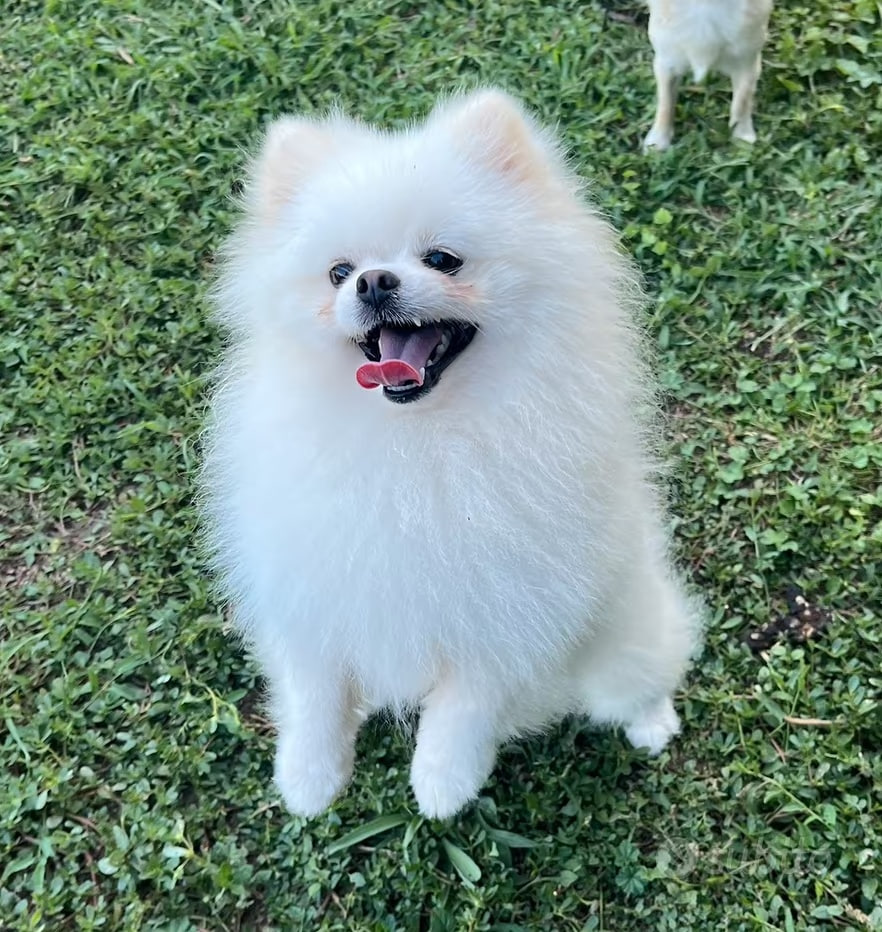

  

# `TOTÒ`

> **There are things you build.**
>
> **And there are things that stay.**

For almost **8 years**, there has been one constant companion behind the scenes.

His name is **Totò**.

A small Pomeranian.  
A very big personality.

And if you've ever wondered about the little character in my profile picture...

**That's him.**

A stylized version of Totò, the same little Pomeranian who has been by my side for almost eight years.

He was here long before this project.  
Long before the community.  
Long before most of you ever knew my name.

He doesn't understand GitHub.  
He doesn't understand smart contracts.  
He certainly doesn't understand what I'm doing at 3 AM.

But somehow, he has always understood one thing:

**staying.**

Eight years.  
Thousands of days.  
One ridiculously loyal little dog.

So if you ever wondered who the **most faithful friend** behind all of this is...

You just found him.

### `TOTÒ`

*The original companion.*

*The one who was here first.*  
*The one who never left.*
