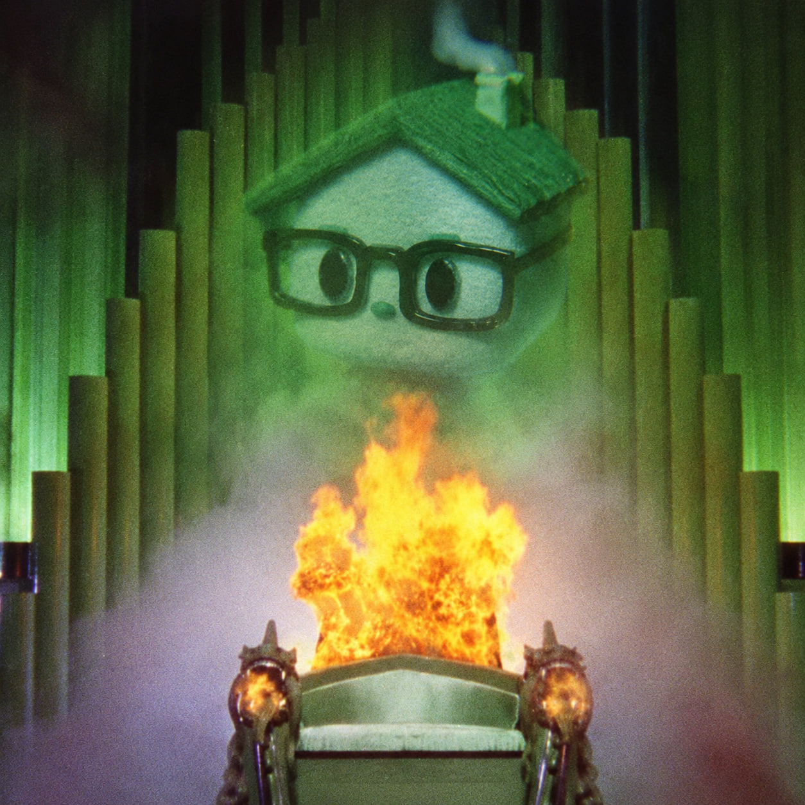

# 奥兹

If you've made it this far, you probably weren't supposed to.

So here's a small secret.

**Ozzy** comes from **Oz** — *The Wizard of Oz*.

That's where **奥兹** comes from too.

It became my nickname long before Pons, before the contracts, before any of this existed.

But I never really cared about Oz because of the wizard.

I cared about what Oz represented.

A place hidden behind the obvious path.  
A world you only reach after following the road far enough.  
Something that looks simple from the outside, but gets stranger the deeper you go.

That's probably why the name stayed.

And that's also why you'll find **奥兹** buried in places where it doesn't seem to belong.

It's not a protocol name.  
It's not a contract identifier.  
It's not part of the architecture.

**It's mine.**

If you found this, you've already gone further than most people will.

There is no place like home.

You just have to find the road first.